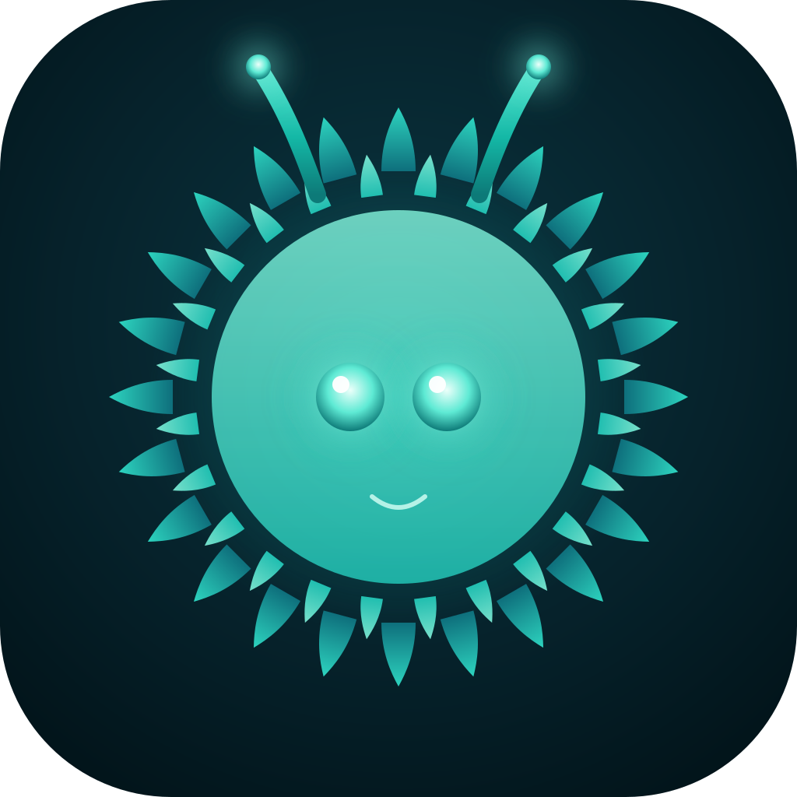

# Curly Brackets

> Your local-first, multi-agent AI workstation. Chat, workflows, agents, and a knowledge graph in one Electron app.



Curly Brackets orchestrates Claude Code and Gemini CLIs as a multi-agent workforce running on your machine. It's a personal control center for everything you'd want a fleet of AI assistants to do — research, code, review, draft, run pipelines — with your own Obsidian vault, project repos, and PDFs as the knowledge layer.

## Features

- **Chat** with any model and pin notes/files for retrieval; @-mention agents, run workflows inline (`/run`)
- **Agents** with their own system prompt, memory, tools, and project bindings; send messages between agents via the `aios` CLI
- **Workflows** — visual DAG builder with parallel execution, conditional edges, approval gates, resume-from-step, cron + file-watch + webhook triggers, and Slack/Discord/file outputs
- **Knowledge graph** — multi-source (Obsidian, folders, PDFs, web pages, codebases), global + per-project; sqlite-vec for cosine retrieval; chunks injected as context per turn
- **Generative UI** — model emits `ui:table` / `ui:chart` / `ui:plan-tree` / `ui:diff` / `ui:form` / `ui:file-picker` / `ui:agent-handoff` blocks that render as interactive components
- **Budgets** — per-agent daily caps + per-workflow per-run caps with auto-pause on threshold
- **Cmd+K** to jump to anything · onboarding wizard · drag-resizable panels · auto-update via GitHub Releases

## Install

Download the latest `.dmg` from [Releases](https://github.com/hitensaxena/curly-brackets/releases).

Right now builds are **unsigned** (no Apple Developer ID yet). On first launch macOS Gatekeeper will block the app — right-click the .app, choose Open, then confirm. The app auto-checks for updates every 4 hours and on launch; banner appears when one is ready.

### Requirements
- macOS 13+ (Apple Silicon)
- Claude Code CLI installed at `/Users/<you>/.local/bin/claude` (or set `CLAUDE_PATH` env)
- Gemini CLI for the Gemini provider (optional)
- OpenAI API key for embeddings (Settings → Knowledge & Memory)

## Develop

```bash
git clone https://github.com/hitensaxena/curly-brackets.git
cd curly-brackets
npm install
npm run dev
```

### Build a DMG locally
```bash
npm run build:icons   # only when icon.svg changed
npm run build:mac     # produces release/Curly Brackets-<version>-arm64.dmg
```

### Publish a release
```bash
# Bump version in package.json, then:
GH_TOKEN=$(gh auth token) npm run build:mac -- --publish always
```

The auto-updater pulls from GitHub Releases. After a release uploads, every running install picks it up within 4 hours (or on next launch) and shows the update banner.

## Project structure

```
src/
├── main/              # Electron main process
│   ├── agents/        # AgentManager (PTY + headless sessions, memory, files, budgets)
│   ├── chat/          # ChatManager (conversations, retrieval injection, fork, save-to-vault)
│   ├── cli/           # ClaudeAdapter + GeminiAdapter
│   ├── db/            # Drizzle schema + sqlite-vec init + migrations
│   ├── knowledge/     # 5 source-type indexers + retrieval + watcher
│   ├── messaging/     # AiosBridge HTTP server, aios CLI, MCP server
│   ├── workflows/     # WorkflowExecutor (parallel DAG) + WorkflowScheduler (cron/file/webhook)
│   ├── ipc/           # Renderer ↔ main IPC handlers
│   ├── AutoUpdater.ts
│   └── index.ts
├── preload/           # contextBridge API
├── renderer/          # React UI
└── shared/types.ts    # cross-process types
```

## Roadmap

Next up:
- **M10** — Glassmorphic UI redesign
- **M11** — Per-agent MCP + Keychain credentials
- **M12** — Workflow versioning + dry-run + for-each
- **M13** — Code-sign + notarise + light theme
- **M14** — Sentry-style error reporting + telemetry (opt-in) + Brew cask

## License

Private — no license declared yet. If you want to use this, please open an issue.
